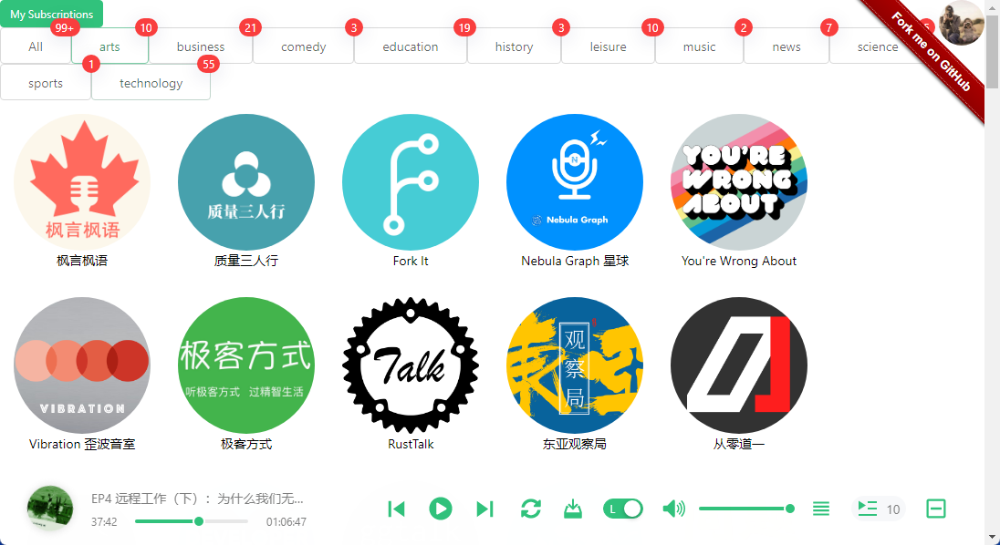

> 以下想法源于[《开源面对面》](https://github.com/opensource-f2f/episode) 。既然播客节目的制作过程、内容是可以开源的，那么，
> 播客平台为什么不可以呢？

本项目，计划采用云原生的方式来开发后端程序，利用 [Kubebuilder](https://github.com/kubernetes-sigs/kubebuilder) 作为
脚手架。

Demo address: http://103.61.38.146:30001/

## Features
* 添加 RSS 播客源
* 添加待收听列表
* 发送播客更新通知到：Slack、飞书

## Screenshot

</img>

## Get started

* 安装 Docker 环境
* 安装 k3d，你可以通过官方给出的教程或者下面的命令 [hd](https://github.com/LinuxSuRen/http-downloader/) 来安装
  * `hd install k3d`
* 安装 k3s（简化版的 Kubernetes）
  * `k3d cluster create -p 30000:30000 -p 30001:30001 -p 30002:30002 -p 30003:30003`
* 安装本项目
  * `make deploy`
* 安装其他可选工具：`kubectl`、`k9s`
  * `hd install kubectl`
  * `hd install k9s`

## Create new API

```shell
kubebuilder create api --group osf2f --version v1alpha1 --kind Profile
```
